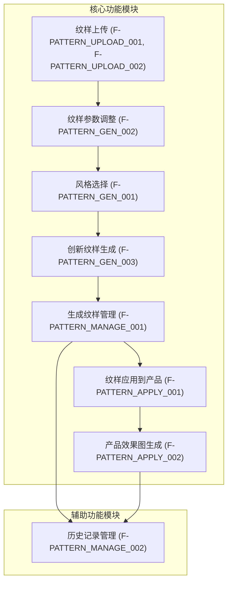
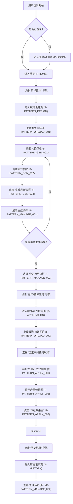
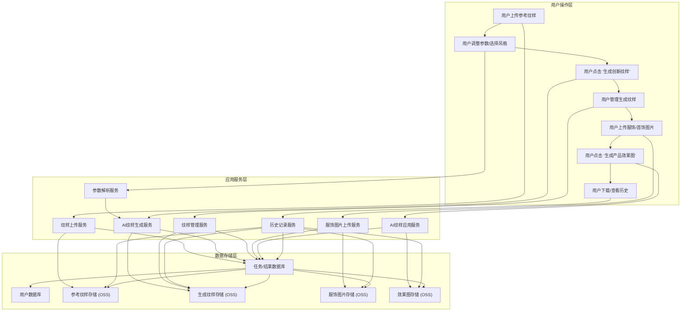

# 染纹创合产品需求文档

## 1. 产品概述

### 1.1 产品名称与定位

*   **产品名称:** 染纹创合
*   **产品定位:** 一款面向手工艺从业者的Web端创意设计工具，旨在通过AI技术辅助用户进行扎染纹样的创新设计与应用预览，解决纹样创新灵感不足的痛点。

### 1.2 产品应用语言

*   **产品应用语言:** 简体中文

### 1.3 产品愿景与目标

*   **产品愿景:** 成为手工艺从业者进行扎染纹样设计与应用的首选工具，激发无限创意，提升设计效率。
*   **产品目标:**
    *   提供便捷的纹样上传与参数调整功能，降低设计门槛。
    *   通过AI生成多样化的创新纹样，为用户提供丰富的设计灵感。
    *   支持纹样在服饰/首饰上的实时预览，加速设计验证过程。
    *   建立用户设计历史记录，方便管理和复用设计成果。

### 1.4 产品使用终端

*   **主要终端:** Web端桌面应用
*   **浏览器支持:** Chrome 90+、Firefox 88+、Safari 14+、Edge 90+
*   **分辨率支持:** 768x480及以上分辨率，最佳体验为1920x1080
*   **响应式适配:** 支持768px以上的所有桌面和平板设备。

### 1.5 核心价值主张

*   **核心价值:** 赋能手工艺从业者，通过AI技术实现扎染纹样的快速创新与可视化应用，打破传统设计瓶颈，提升设计效率与创意产出。

### 1.6 目标用户群体分析

*   **主要用户:** 手工艺从业者
*   **用户特征:**
    *   对扎染艺术有浓厚兴趣和一定基础。
    *   在设计过程中可能面临灵感枯竭、传统设计效率低的问题。
    *   希望通过新技术提升设计能力和作品多样性。
    *   注重设计成果的可视化和应用效果。
*   **用户痛点:**
    *   纹样创新灵感不足，难以突破传统样式。
    *   手工绘制或修改纹样耗时耗力。
    *   难以直观预览纹样在实际产品上的效果。
    *   设计成果管理不便，难以追溯和复用。

### 1.7 市场需求与竞品简析

*   **市场需求:** 随着手工艺复兴和个性化定制趋势，对传统工艺与现代科技结合的设计工具需求日益增长。手工艺从业者需要高效、智能的工具来辅助创作，尤其是在纹样设计和应用预览方面。
*   **竞品简析:**
    *   **传统设计软件 (如Photoshop, Illustrator):** 功能强大但学习成本高，缺乏AI辅助生成和特定工艺（如扎染）的智能参数调整。
    *   **通用AI绘画工具 (如Midjourney, DALL-E):** 擅长图像生成，但缺乏针对扎染纹样的专业参数控制和与服饰/首饰的精准贴合功能。
    *   **垂直领域设计工具:** 数量较少，功能可能不够完善，或主要面向企业级用户，不适合个人手工艺从业者。
*   **染纹创合优势:** 专注于扎染纹样的AI创新与应用，提供专业参数调整和服饰预览，填补市场空白，为手工艺从业者提供定制化解决方案。

### 1.8 浏览器兼容性要求

*   **桌面浏览器:**
    *   Google Chrome (最新2个稳定版本)
    *   Mozilla Firefox (最新2个稳定版本)
    *   Microsoft Edge (最新2个稳定版本)
    *   Apple Safari (最新2个稳定版本)
*   **最低分辨率:** 1024x768px
*   **推荐分辨率:** 1920x1080px 及以上

## 2. 功能规格

### 2.1 功能详述

#### 2.1.1 纹样上传与管理

| 功能ID | 功能名称 | 功能描述 | 优先级 |
|--------|---------|---------|--------|
| F-PATTERN_UPLOAD_001 | 参考纹样上传 | 提供两个独立的上传入口，支持用户上传本地图片文件（格式不限）或直接拖入图片。上传后实时显示小图预览，并提供删除和重新上传功能。 | P0 |
| F-PATTERN_UPLOAD_002 | 服饰/首饰图片上传 | 提供上传入口，支持用户上传平整的服饰/首饰图片（如T恤、围巾、耳环等）。上传后实时显示预览。 | P0 |
| F-PATTERN_MANAGE_001 | 生成纹样管理 | 展示AI生成的候选纹样大图预览。每个纹样下方提供“下载”、“删除”、“设为待用纹样”、“重命名”操作按钮。支持批量删除所有生成纹样。 | P0 |
| F-PATTERN_MANAGE_002 | 历史记录管理 | 按时间顺序展示用户的所有设计历史记录，包括参考纹样、生成参数、生成纹样和应用效果图。支持查看详情、下载和删除操作。 | P1 |

#### 2.1.2 纹样生成与参数调整

| 功能ID | 功能名称 | 功能描述 | 优先级 |
|--------|---------|---------|--------|
| F-PATTERN_GEN_001 | 风格选择 | 提供多种扎染风格选项（如“传统蓝白晕染”、“撞色渐变扎染”、“水墨风扎染”、“几何线条扎染”等），支持单选或多选倾向。 | P0 |
| F-PATTERN_GEN_002 | 细节参数调整 | 提供滑块和输入框，用于调节“晕染浓度（0-100%）”、“花纹疏密（0-100%）”、“融合强度（0-100%）”、“色彩饱和度（0-100%）”、“纹样大小（0-100%）”。 | P0 |
| F-PATTERN_GEN_003 | 创新纹样生成 | 基于用户上传的双参考纹样和设定的参数，生成自定义数量（用户可设置）的候选扎染纹样。每次点击生成按钮将重新生成新的纹样。生成后默认展示在右侧预览区。 | P0 |

#### 2.1.3 纹样应用与预览

| 功能ID | 功能名称 | 功能描述 | 优先级 |
|--------|---------|---------|--------|
| F-PATTERN_APPLY_001 | 纹样应用到产品 | 将用户从生成纹样管理区选中的“待用纹样”，贴合到用户上传的服饰/首饰/文创产品图片上（如T恤的衣身、围巾的整体、耳环的表面、文创产品的表面等）。 | P0 |
| F-PATTERN_APPLY_002 | 产品效果图生成 | 生成带纹样的成品图，支持选择不同尺寸，提供“下载效果图”按钮。 | P0 |

### 2.2 功能模块间的关系图

## 3. 用户流程

### 3.1 用户旅程地图

| 阶段 | 用户目标 | 用户行为 | 系统响应 | 痛点/机遇 | 情绪 |
|---|---|---|---|---|---|
| **1. 灵感探索** | 寻找扎染纹样灵感 | 访问网站，浏览首页，了解产品功能 | 展示产品介绍、核心功能、使用案例 | 传统设计灵感枯竭 | 期待 |
| **2. 纹样上传** | 上传参考纹样 | 进入纹样设计页，点击上传按钮，选择本地图片 | 实时显示上传进度和预览图 | 上传不便，预览不清晰 | 专注 |
| **3. 参数调整** | 调整纹样生成参数 | 选择扎染风格，拖动滑块调整晕染浓度、花纹疏密等 | 实时反馈参数变化，提供视觉提示 | 参数复杂，效果难以预测 | 调整 |
| **4. 纹样生成** | 生成创新纹样 | 点击“生成创新纹样”按钮 | 显示生成进度，生成后展示候选纹样 | 生成时间长，结果不满意 | 期待/惊喜 |
| **5. 纹样管理** | 筛选和管理生成纹样 | 浏览候选纹样，点击下载、删除、设为待用或重命名 | 执行相应操作，更新界面显示 | 纹样过多难以管理，操作繁琐 | 整理 |
| **6. 产品应用** | 预览纹样在产品上的效果 | 上传服饰/首饰图片，选择待用纹样，点击“生成产品效果图” | 显示生成进度，生成后展示效果图 | 贴合效果不佳，预览不直观 | 验证 |
| **7. 成果保存** | 保存设计成果 | 点击下载按钮，保存生成的纹样或效果图 | 文件下载到本地 | 下载格式不兼容，历史记录丢失 | 满足 |
| **8. 历史回顾** | 查看和管理历史设计 | 进入历史记录页，浏览过往设计 | 展示历史设计列表，支持查看详情 | 历史记录查找困难 | 回顾 |

### 3.2 关键业务流程图

### 3.3 各场景下的用户操作步骤

#### 3.3.1 场景一：生成并管理创新纹样

1.  **用户操作:** 访问染纹创合网站，点击顶部导航栏的“纹样设计”进入纹样设计页（P-PATTERN_DESIGN）。
2.  **用户操作:** 在“参考纹样上传区”点击“参考纹样 1”上传入口，选择本地图片并上传。
3.  **用户操作:** 重复步骤2，上传“参考纹样 2”。
4.  **用户操作:** 在“风格选择”区，勾选“传统蓝白晕染”和“水墨风扎染”。
5.  **用户操作:** 在“细节参数”区，拖动滑块将“晕染浓度”调整为60%，“花纹疏密”调整为40%，“融合强度”调整为80%，“色彩饱和度”调整为70%，“纹样大小”调整为50%。
6.  **用户操作:** 点击“生成创新纹样”按钮。
7.  **系统响应:** 显示生成进度条，生成完成后在“生成纹样管理区”展示3张候选纹样大图。
8.  **用户操作:** 浏览候选纹样，点击第二张纹样下方的“设为待用纹样”按钮。
9.  **用户操作:** 点击第三张纹样下方的“删除”按钮，在确认弹窗中点击“确认”。
10. **用户操作:** 点击“清空所有生成纹样”按钮，在确认弹窗中点击“确认”。

#### 3.3.2 场景二：将纹样应用到服饰并下载效果图

1.  **用户操作:** 从纹样设计页（P-PATTERN_DESIGN）或顶部导航栏点击“服饰/首饰应用”进入服饰/首饰应用页（P-APPLICATION）。
2.  **用户操作:** 在“服饰/首饰图片上传入口”点击上传按钮，选择一张T恤图片并上传。
3.  **系统响应:** 页面显示T恤图片预览。
4.  **用户操作:** 在“已选中的待用纹样”区域，确认已选中之前设置的纹样。
5.  **用户操作:** 点击“生成产品效果图”按钮。
6.  **系统响应:** 显示生成进度条，生成完成后在下方展示带纹样的T恤效果图。
7.  **用户操作:** 点击“下载效果图”按钮，将效果图保存到本地。

#### 3.3.3 场景三：查看历史设计记录

1.  **用户操作:** 点击顶部导航栏的“历史记录”进入历史记录页（P-HISTORY）。
2.  **系统响应:** 页面按时间顺序展示用户的所有设计历史记录列表。
3.  **用户操作:** 点击某条历史记录的“查看详情”按钮。
4.  **系统响应:** 弹出详情抽屉，展示该次设计的参考纹样、生成参数、生成纹样和应用效果图。
5.  **用户操作:** 在详情抽屉中点击“下载”按钮，下载该次设计的生成纹样。
6.  **用户操作:** 关闭详情抽屉，点击列表中某条记录的“删除”按钮，在确认弹窗中点击“确认”。

## 4. 数据流设计

### 4.1 数据结构与关系

*   **用户 (User):**
    *   `user_id` (PK)
    *   `username`
    *   `password_hash`
    *   `email`
    *   `created_at`
    *   `last_login_at`
*   **参考纹样 (ReferencePattern):**
    *   `pattern_id` (PK)
    *   `user_id` (FK to User)
    *   `image_url` (存储图片路径)
    *   `uploaded_at`
    *   `is_active` (是否当前设计中使用)
*   **生成任务 (GenerationTask):**
    *   `task_id` (PK)
    *   `user_id` (FK to User)
    *   `ref_pattern1_id` (FK to ReferencePattern)
    *   `ref_pattern2_id` (FK to ReferencePattern)
    *   `style_options` (JSONB, 存储选择的风格)
    *   `dye_concentration` (晕染浓度)
    *   `pattern_density` (花纹疏密)
    *   `fusion_strength` (融合强度)
    *   `color_saturation` (色彩饱和度)
    *   `pattern_size` (纹样大小)
    *   `num_candidates` (生成候选数量)
    *   `status` (任务状态: pending, completed, failed)
    *   `started_at`
    *   `completed_at`
*   **生成纹样 (GeneratedPattern):**
    *   `gen_pattern_id` (PK)
    *   `task_id` (FK to GenerationTask)
    *   `image_url` (存储生成图片路径)
    *   `is_selected` (是否被设为待用)
    *   `created_at`
    *   `name` (用户自定义名称)
*   **应用任务 (ApplicationTask):**
    *   `app_task_id` (PK)
    *   `user_id` (FK to User)
    *   `gen_pattern_id` (FK to GeneratedPattern)
    *   `product_image_url` (存储上传的服饰/首饰图片路径)
    *   `status` (任务状态: pending, completed, failed)
    *   `started_at`
    *   `completed_at`
*   **应用效果图 (ApplicationResult):**
    *   `result_id` (PK)
    *   `app_task_id` (FK to ApplicationTask)
    *   `image_url` (存储生成的效果图路径)
    *   `created_at`

### 4.2 关键数据流向图

### 4.3 数据存储与处理原则

1.  **数据安全:**
    *   用户密码采用加盐哈希存储，确保不可逆。
    *   所有敏感数据传输采用HTTPS加密。
    *   定期进行数据备份和灾难恢复演练。
    *   严格控制数据访问权限，遵循最小权限原则。
2.  **数据存储:**
    *   结构化数据（用户信息、任务状态、参数等）存储在关系型数据库（如PostgreSQL）中。
    *   非结构化数据（图片文件）存储在对象存储服务（OSS）中，以提高读写效率和可扩展性。
    *   图片文件应进行压缩和优化，以减少存储成本和传输带宽。
3.  **数据处理:**
    *   AI生成和应用任务采用异步处理，避免阻塞用户界面。
    *   任务队列管理，确保任务有序执行和资源合理分配。
    *   生成的纹样和效果图应支持多种分辨率和格式，以满足不同下载需求。
    *   历史记录数据应支持按时间、关键词等进行查询和筛选。
4.  **数据一致性:**
    *   确保用户操作与后端数据状态保持一致，通过事务管理和状态同步机制。
    *   生成任务和应用任务的状态流转清晰，便于追踪和管理。
5.  **可扩展性:**
    *   数据库设计考虑未来功能扩展，采用范式化设计。
    *   存储方案支持水平扩展，应对未来数据量增长。

## 5. 页面规格

### 5.1 页面概览

#### 5.1.1 整体布局架构

*   **布局模式:** Web端响应式布局 - 固定顶部导航栏 + 主内容区(最小720px) + 可选左侧菜单(200-240px/48-56px) + 可选右侧面板(280-320px)
*   **空间分配策略:**
    *   大屏幕(≥1440px): 顶部60px + 左侧200-240px(可选) + 主内容区(动态) + 右侧280-320px(可选)
    *   中屏幕(1200-1439px): 顶部60px + 左侧200-240px(可选) + 主内容区(充满剩余空间)
    *   小屏幕(768-1199px): 顶部60px + 左侧菜单(折叠/抽屉，可选) + 主内容区(充满)
*   **导航体系:** 顶部主导航 + 左侧功能菜单(可选) + 面包屑导航(可选)
*   **交互模式:** 页面切换 + 模态弹窗 + 侧边抽屉 + 右键菜单
*   **右侧面板使用:** 根据功能需要合理使用，提供辅助功能。**严格限制使用**：仅在屏幕宽度≥1440px且功能确实必要时使用，必须在布局中占据独立空间，绝对不能遮挡主内容区，且需确保主内容区宽度≥720px。

#### 5.1.2 页面列表

| 页面ID | 页面名称 | 核心功能 | 布局类型 | 右侧面板 |
|--------|---------|---------|---------|---------|
| P-HOME | 首页 | 产品介绍、功能入口、用户引导 | 单栏/二栏布局 | 慎用(仅在≥1440px且必要时) |
| P-PATTERN_DESIGN | 纹样组合页 | 参考纹样上传、参数调整、风格选择、纹样生成、重组效果图展示、生成纹样管理 | 二栏布局 | 不使用 |
| P-ELEMENT_COMBINE | 元素组合页 | 元素上传、构图选择、纹样重组、重组效果图展示 | 二栏布局 | 不使用 |
| P-APPLICATION | 服饰/首饰应用页 | 服饰/首饰图片上传、纹样应用、效果图生成与下载 | 二栏布局 | 不使用 |
| P-HISTORY | 历史记录页 | 历史设计记录列表展示、查看详情、下载、删除 | 二栏布局 | 不使用 |
| P-HELP | 帮助指南页 | 产品使用教程、常见问题解答 | 二栏布局 | 不使用 |
| P-LOGIN | 登录/注册页 | 用户登录、注册、密码找回 | 单栏居中布局 | 不使用 |

### 5.2 页面详情

#### 5.2.1 首页（P-HOME）

**布局架构设计：**
- 页面类型：展示页面，包含核心内容展示和导航功能
- 布局模式：灵活布局，根据内容类型选择单栏或可选三栏
- 空间分配：顶部导航 + 主内容区(最小720px) + 可选侧边区域

**页面布局架构：**
- 顶部导航栏：Logo、主导航菜单（首页、纹样组合、元素组合、服饰/首饰应用、历史记录、帮助指南）、用户头像/登录注册入口 - 建议高度60px，固定定位
- 左侧菜单：无
- 主内容区域：核心展示区域，建议最小宽度720px
  - 页面头部：产品Slogan、核心价值介绍、主要功能入口按钮 - 建议高度120-180px
  - 内容展示区：产品特性介绍、使用案例展示、用户评价等，可采用卡片或图文结合形式 - 自适应高度
  - 底部区域：版权信息、备案信息、隐私政策链接等 - 建议高度60px
- 右侧面板：**慎用**：仅在屏幕宽度≥1440px且功能确实必要时使用，辅助功能区域，宽度280-320px（**严格要求：在布局中占据独立空间，绝对不能遮挡主内容，且需确保主内容区宽度≥720px**）
  - 推荐内容：相关推荐、热门内容等（**非关键信息**）
  - 操作面板：快速操作、工具栏等（**非核心功能**）
  - 信息展示：统计信息、状态显示等（**必须在主内容区有完整替代方案**）

**响应式适配策略：**
- 大屏幕(≥1440px)：推荐单栏或二栏布局，仅在功能确实必要时考虑三栏布局，如使用三栏则左侧200-240px + 主内容区(≥720px) + 右侧280-320px（**所有面板均占据布局空间，严禁遮挡**）
- 中屏幕(1200-1439px)：二栏布局，**严禁使用右侧面板**，主内容区充满剩余空间
- 小屏幕(768-1199px)：单栏布局，内容改为响应式布局
- 移动端(<768px)：单栏布局，内容单列显示，保持核心功能（**所有侧边面板均隐藏或抽屉化**）

**组件尺寸规范：**
- 按钮尺寸：主要操作按钮40px高度，次要按钮32px高度
- 输入框：搜索框36px高度
- 内容卡片：最小高度180px，宽度自适应，最小280px
- 图标尺寸：导航图标20px，操作图标16px
- 间距规范：卡片间距24px，区域间距32px，组件内间距16px

**核心功能：**
产品介绍、功能入口、用户引导、快速操作、信息概览

#### 5.2.2 纹样组合页（P-PATTERN_DESIGN）

**布局架构设计：**
- 页面类型：功能操作页，包含纹样上传、参数调整、风格选择、纹样生成和管理
- 布局模式：左右分栏布局，左侧为输入区，右侧为效果图展示区
- 空间分配：顶部导航 + 左侧输入区(40%) + 右侧预览区(60%)

**页面布局架构：**
- 顶部导航栏：Logo、主导航菜单、用户头像 - 建议高度60px，固定定位
- 左侧菜单：无
- 主内容区域：核心功能操作区域，建议最小宽度720px
  - 页面头部：页面标题“纹样设计”、面包屑导航（首页 > 纹样设计） - 建议高度48px
  
  **左侧输入区:**
  - **参考纹样上传区:**
    - 包含“参考纹样 1”和“参考纹样 2”两个上传入口，支持点击上传或直接拖入图片，每个入口下方有上传提示文字。
    - 上传后显示小图预览（建议尺寸150x150px），预览图下方有“删除”按钮。
    - 区域高度自适应，建议最小高度200px。
  - **模型选择区:**
    - 提供多种AI模型选项，如“创新设计模型”、“传统风格模型”、“现代艺术模型”等，支持单选。
    - 区域高度自适应，建议最小高度100px。
  - **纹样生成参数区:**
    - 包含“风格选择”和“细节参数”两个子板块。
    - “风格选择”：提供多个扎染风格选项（如“传统蓝白晕染”、“撞色渐变扎染”、“水墨风扎染”、“几何线条扎染”等），以复选框形式呈现。
    - “细节参数”：包含“晕染浓度”、“花纹疏密”、“融合强度”、“色彩饱和度”、“纹样大小”五个可调节滑块和对应的输入框（0-100%）。
    - 区域高度自适应，建议最小高度300px。
  - **操作按钮区:**
    - 包含“生成创新纹样”按钮（主要操作按钮），点击后重新生成新的纹样。
    - 按钮高度40px，宽度自适应。
  
  **右侧预览区:**
  - **生成纹样展示区:**
    - 展示生成的候选纹样大图预览（建议尺寸600x600px），每次点击生成按钮将刷新显示新的纹样。
    - 每个纹样下方有“下载”、“删除”、“设为待用纹样”、“重命名”按钮。
    - 区域顶部有“清空所有生成纹样”按钮。
    - 区域高度自适应，建议最小高度600px。

**响应式适配策略：**
- 大屏幕(≥1440px)：二栏布局，主内容区宽度自适应，充分利用可用空间。
- 中屏幕(1200-1439px)：二栏布局，主内容区充满剩余空间。
- 小屏幕(768-1199px)：单栏布局，各功能区域垂直堆叠，滑块和按钮尺寸适应屏幕。
- 移动端(<768px)：单栏布局，内容单列显示，保持核心功能。

**组件尺寸规范：**
- 按钮尺寸：主要操作按钮40px高度，次要操作按钮32px高度。
- 输入框：参数输入框32px高度。
- 滑块：高度20px。
- 预览图：参考纹样预览图150x150px，生成纹样预览图300x300px。
- 间距规范：组件间距16px，区域间距24px。

**核心功能：**
参考纹样上传、扎染风格选择、细节参数调整、创新纹样生成、生成纹样管理（下载、删除、设为待用、重命名、批量删除）。

#### 5.2.3 服饰/首饰应用页（P-APPLICATION）

**布局架构设计：**
- 页面类型：功能操作页，用于将生成的纹样应用到服饰/首饰图片并生成效果图
- 布局模式：左右分栏布局，左侧为输入区，右侧为效果图展示区
- 空间分配：顶部导航 + 左侧输入区(40%) + 右侧预览区(60%)

**页面布局架构：**
- 顶部导航栏：Logo、主导航菜单、用户头像 - 建议高度60px，固定定位
- 左侧菜单：无
- 主内容区域：核心功能操作区域，建议最小宽度720px
  - 页面头部：页面标题“产品应用：将纹样应用到服饰/首饰/文创”、面包屑导航（首页 > 产品应用） - 建议高度48px
  
  **左侧输入区:**
  - **产品图片上传区:**
    - 包含上传入口，提示文字“请上传平整的服饰/首饰/文创产品图片，如T恤、围巾、耳环、笔记本封面等”。
    - 上传后显示预览图（建议尺寸300x300px）。
    - 区域高度自适应，建议最小高度250px。
  - **已选中的待用纹样区:**
    - 显示当前选中的待用纹样预览图（建议尺寸150x150px）。
    - 提供“切换纹样”按钮，点击可弹出纹样选择器（模态弹窗）。
    - 区域高度自适应，建议最小高度180px。
  - **效果图尺寸选择区:**
    - 提供多种预设尺寸选项（如"小(300x300)"、"中(600x600)"、"大(1200x1200)"）和自定义尺寸输入框。
    - 区域高度自适应，建议最小高度100px。
  - **操作按钮区:**
    - 包含“生成产品效果图”按钮（主要操作按钮）。
    - 按钮高度40px，宽度自适应。
  
  **右侧预览区:**
  - **产品效果图展示区:**
    - 展示生成的带纹样的成品图（根据选择的尺寸动态调整）。
    - 成品图下方提供“下载效果图”按钮。
    - 区域高度自适应，建议最小高度600px。

**响应式适配策略：**
- 大屏幕(≥1440px)：二栏布局，主内容区宽度自适应，充分利用可用空间。
- 中屏幕(1200-1439px)：二栏布局，主内容区充满剩余空间。
- 小屏幕(768-1199px)：单栏布局，各功能区域垂直堆叠，图片预览尺寸适应屏幕。
- 移动端(<768px)：单栏布局，内容单列显示，保持核心功能。

**组件尺寸规范：**
- 按钮尺寸：主要操作按钮40px高度，次要操作按钮32px高度。
- 预览图：服饰/首饰图片预览图400x400px，待用纹样预览图150x150px，效果图600x600px。
- 间距规范：组件间距16px，区域间距24px。

**核心功能：**
服饰/首饰图片上传、已选中待用纹样展示与切换、产品效果图生成、效果图下载。

#### 5.2.4 历史记录页（P-HISTORY）

**布局架构设计：**
- 页面类型：列表展示页，用于展示用户的历史设计记录
- 布局模式：二栏布局
- 空间分配：顶部导航 + 左侧菜单（无）+ 主内容区（列表展示）

**页面布局架构：**
- 顶部导航栏：Logo、主导航菜单、用户头像 - 建议高度60px，固定定位
- 左侧菜单：无
- 主内容区域：核心功能操作区域，建议最小宽度720px
  - 页面头部：页面标题“历史记录”、面包屑导航（首页 > 历史记录） - 建议高度48px
  - **工具栏区域:**
    - 包含搜索框（按关键词搜索）、筛选条件（按时间范围、设计类型）、批量操作按钮（如“批量删除”）。
    - 建议高度40-48px。
  - **数据展示区域:**
    - 以表格形式展示历史设计记录，按时间顺序排列。
    - 每行包含：设计名称（可点击查看详情）、参考纹样缩略图、生成纹样缩略图、应用效果图缩略图、生成时间、操作（查看详情、下载、删除）。
    - 表格支持列排序、筛选、列宽调整。
    - 自适应高度。
  - **分页区域:**
    - 位于表格下方，包含分页控件，显示总数、每页条数选择、跳转功能。
    - 建议高度40px。

**响应式适配策略：**
- 大屏幕(≥1440px)：二栏布局，主内容区宽度自适应，表格列宽充分展开。
- 中屏幕(1200-1439px)：二栏布局，主内容区充满剩余空间，表格列宽自适应。
- 小屏幕(768-1199px)：单栏布局，表格列可折叠或部分隐藏，提供横向滚动条。
- 移动端(<768px)：单栏布局，表格转换为卡片列表形式，或仅显示核心信息。

**组件尺寸规范：**
- 按钮尺寸：操作按钮32px高度。
- 输入框：搜索框32px高度。
- 表格行高：36-40px。
- 缩略图：80x80px。
- 间距规范：组件间距12px，区域间距20px。

**核心功能：**
历史设计记录列表展示、搜索、筛选、查看详情、下载、删除、批量删除。

**数据结构：**
| 列名 | 数据类型 | 宽度建议 | 是否可排序 | 操作功能 |
|------|---------|----------|----------|---------|
| 设计名称 | 文本+链接 | 200px | 是 | 点击查看详情 |
| 参考纹样 | 图片缩略图 | 120px | 否 | 预览 |
| 生成纹样 | 图片缩略图 | 120px | 否 | 预览 |
| 应用效果图 | 图片缩略图 | 120px | 否 | 预览 |
| 生成时间 | 日期时间 | 150px | 是 | 排序 |
| 操作 | 操作按钮组 | 180px | 否 | 查看详情、下载、删除 |

#### 5.2.5 帮助指南页（P-HELP）

**布局架构设计：**
- 页面类型：信息展示页，提供产品使用教程和常见问题解答
- 布局模式：二栏布局
- 空间分配：顶部导航 + 左侧菜单（无）+ 主内容区（文章/列表）

**页面布局架构：**
- 顶部导航栏：Logo、主导航菜单、用户头像 - 建议高度60px，固定定位
- 左侧菜单：无
- 主内容区域：核心功能操作区域，建议最小宽度720px
  - 页面头部：页面标题“帮助指南”、面包屑导航（首页 > 帮助指南） - 建议高度48px
  - **内容导航区:**
    - 左侧或顶部提供帮助内容分类导航（如“入门教程”、“功能详解”、“常见问题”）。
    - 建议宽度200px（左侧）或高度40px（顶部）。
  - **内容展示区:**
    - 根据导航选择，展示对应的帮助文章或FAQ列表。
    - 文章内容支持图文混排，FAQ列表支持点击展开/收起答案。
    - 自适应高度。

**响应式适配策略：**
- 大屏幕(≥1440px)：二栏布局，主内容区宽度自适应。
- 中屏幕(1200-1439px)：二栏布局，主内容区充满剩余空间。
- 小屏幕(768-1199px)：单栏布局，内容导航可折叠或转换为下拉菜单。
- 移动端(<768px)：单栏布局，内容单列显示。

**组件尺寸规范：**
- 按钮尺寸：无特定按钮。
- 间距规范：内容块间距24px，行间距1.5em。

**核心功能：**
提供产品使用教程、常见问题解答、内容分类导航。

#### 5.2.6 元素组合页（P-ELEMENT_COMBINE）

**布局架构设计：**
- 页面类型：功能操作页，用于元素上传和构图选择进行纹样重组
- 布局模式：左右分栏布局，左侧为输入区，右侧为效果图展示区
- 空间分配：顶部导航 + 左侧输入区(40%) + 右侧预览区(60%)

**页面布局架构：**
- 顶部导航栏：Logo、主导航菜单、用户头像 - 建议高度60px，固定定位
- 左侧菜单：无
- 主内容区域：核心功能操作区域，建议最小宽度720px
  - 页面头部：页面标题“元素组合”、面包屑导航（首页 > 元素组合） - 建议高度48px
  
  **左侧输入区:**
  - **元素上传区:**
    - 包含上传入口，支持用户上传单个元素图片。
    - 上传后显示预览图（建议尺寸300x300px）。
    - 区域高度自适应，建议最小高度250px。
  - **构图选择区:**
    - 提供多种构图选项，如"对称"、"置于四角"、"中线对称"、"重复排列"、"放射状"等。
    - 以图标+文字形式展示，支持单选。
    - 区域高度自适应，建议最小高度200px。
  - **重组参数区:**
    - 包含"元素大小"、"间距调整"、"旋转角度"、"透明度"等可调节参数。
    - 根据选择的构图类型动态显示相关参数调节控件。
    - 区域高度自适应，建议最小高度150px。
  - **操作按钮区:**
    - 包含"生成组合纹样"按钮（主要操作按钮）。
    - 按钮高度40px，宽度自适应。
  
  **右侧预览区:**
  - **组合纹样展示区:**
    - 实时展示根据选择的构图和参数生成的组合纹样效果。
    - 提供多角度预览功能。
    - 每个组合效果下方有"下载"、"设为待用纹样"按钮。
    - 区域高度自适应，建议最小高度600px。

**响应式适配策略：**
- 大屏幕(≥1440px)：二栏布局，主内容区宽度自适应，充分利用可用空间。
- 中屏幕(1200-1439px)：二栏布局，主内容区充满剩余空间。
- 小屏幕(768-1199px)：单栏布局，各功能区域垂直堆叠，图片预览尺寸适应屏幕。
- 移动端(<768px)：单栏布局，内容单列显示，保持核心功能。

**组件尺寸规范：**
- 按钮尺寸：主要操作按钮40px高度，次要操作按钮32px高度。
- 预览图：元素预览图300x300px，组合纹样预览图600x600px。
- 构图选项：图标尺寸60x60px，间距16px。
- 间距规范：组件间距16px，区域间距24px。

**核心功能：**
元素上传、构图选择（对称、置于四角、中线对称等）、重组参数调整、组合纹样生成与预览、组合纹样下载与设为待用。

#### 5.2.6 登录/注册页（P-LOGIN）

**布局架构设计：**
- 页面类型：功能操作页，用于用户登录、注册和密码找回
- 布局模式：单栏居中布局
- 空间分配：页面主体内容居中显示，背景为产品相关图片或纯色。

**页面布局架构：**
- 顶部导航栏：Logo、产品名称 - 建议高度60px，固定定位
- 左侧菜单：无
- 主内容区域：核心功能操作区域，建议宽度400-500px，居中显示
  - **登录/注册表单区:**
    - 包含“登录”和“注册”两个Tab切换。
    - **登录Tab:** 用户名/邮箱输入框、密码输入框、记住密码复选框、登录按钮、忘记密码链接。
    - **注册Tab:** 用户名输入框、邮箱输入框、密码输入框、确认密码输入框、注册按钮。
    - 表单元素高度40px，按钮高度44px。
  - **其他登录方式区:**
    - 可选，如微信、QQ等第三方登录图标。
    - 图标尺寸40x40px。

**响应式适配策略：**
- 大屏幕(≥1440px)：单栏居中布局，表单区域宽度固定。
- 中屏幕(1200-1439px)：单栏居中布局，表单区域宽度固定。
- 小屏幕(768-1199px)：单栏居中布局，表单区域宽度自适应，最大宽度不超过屏幕宽度的80%。
- 移动端(<768px)：单栏布局，表单区域宽度充满屏幕，上下边距适当。

**组件尺寸规范：**
- 按钮尺寸：登录/注册按钮44px高度。
- 输入框：40px高度。
- 间距规范：表单项间距16px，按钮与表单间距24px。

**核心功能：**
用户登录、用户注册、密码找回。